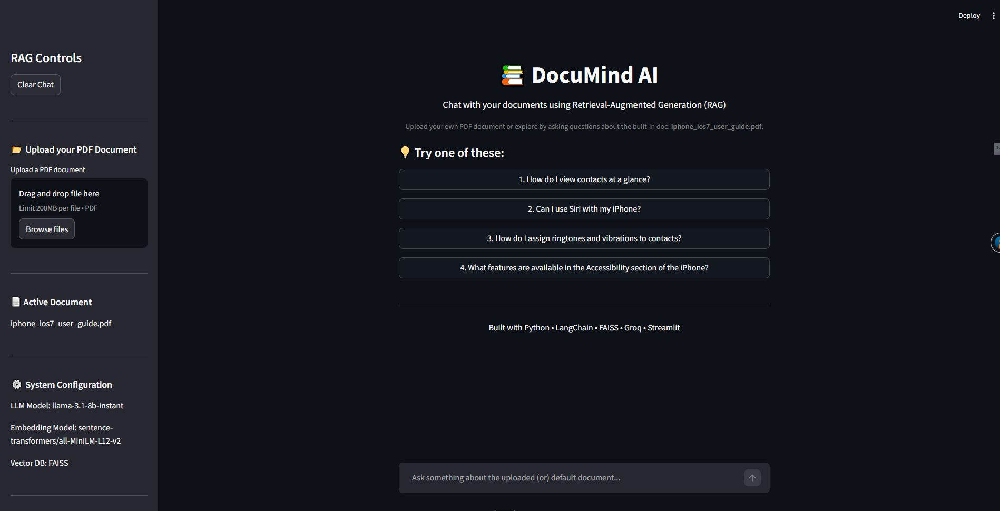

# 📚 DocuMind AI — RAG Document Chatbot


DocuMind AI is an intelligent **Retrieval-Augmented Generation (RAG)** powered chatbot that allows users to interact with PDF documents conversationally.

Instead of manually searching through long documents, users can ask natural language questions and receive **context-aware answers grounded in the document content**.

The system combines **LLMs, vector retrieval, and document embeddings** to generate responses that are accurate, explainable, and sourced directly from the uploaded document.

---

## Highlights

• Built an end-to-end Retrieval Augmented Generation pipeline  
• Implemented cross-encoder reranking for improved retrieval accuracy  
• Added semantic confidence scoring for answer reliability  
• Designed dynamic question suggestions for better user onboarding  
• Built interactive Streamlit interface with document upload support

---

---

## How It Works

1. Documents are loaded and split into chunks
2. Each chunk is embedded using sentence-transformers
3. Embeddings are stored in a FAISS vector database
4. User queries retrieve relevant chunks
5. Chunks are reranked using a cross-encoder
6. Top context is passed to Groq LLM
7. Response is generated with source citations

---

# 🚀 Demo UI

## Live Demo
Streamlit App: Coming Soon...



---

# 📌 Project Overview

Large Language Models alone cannot answer questions about **external or private documents**, because they rely only on training data.

DocuMind AI solves this using **Retrieval-Augmented Generation (RAG)**.

### Workflow

1. A document is uploaded
2. The document is split into smaller chunks
3. Each chunk is converted into embeddings
4. Embeddings are stored in a vector database
5. A user asks a question
6. Relevant chunks are retrieved from the vector database
7. The retrieved context is passed to the LLM
8. The LLM generates a grounded response

This ensures answers are:

- Context aware
- Source grounded
- Explainable

---

# ✨ Key Features

### 📄 Document Q&A
Upload any PDF and ask questions about its contents using natural language.

### 🧠 Retrieval Augmented Generation
Combines vector retrieval with LLM reasoning to generate grounded answers.

### 💡 Dynamic Suggested Questions
Automatically generates helpful starter questions based on the uploaded document.

### 📊 Confidence Score
Each answer includes a confidence indicator derived from reranking similarity scores.

### 🔎 Cross Encoder Reranking
Retrieved chunks are reranked using a CrossEncoder model to improve answer accuracy.

### 📚 Source Transparency
Users can inspect the exact document chunks used to generate the response.

### 💬 Conversation Memory
The chatbot remembers the conversation history for contextual follow-up questions.

---

# 🏗 System Architecture

Detailed architecture documentation can be found here:

docs/architecture.md

---

## RAG Pipeline

```
User Query
    ↓
Query Processing
    ↓
Vector Retrieval (FAISS)
    ↓
Cross Encoder Reranking
    ↓
Context Injection
    ↓
LLM Response Generation
    ↓
Answer + Sources + Confidence Score
```

---

# ⚙️ Core RAG Components

### Document Loader

PDF files are loaded using:

PyPDFLoader

---

### Text Chunking

Documents are split into smaller pieces using:

RecursiveCharacterTextSplitter

Chunking improves retrieval accuracy and ensures the LLM receives manageable context sizes.

---

### Embeddings

Document chunks are converted into embeddings using:

sentence-transformers/all-MiniLM-L12-v2

Embeddings capture semantic meaning for similarity search.

---

### Vector Database

Embeddings are stored in:

FAISS

FAISS enables fast similarity search over document embeddings.

---

### Retriever

The retriever uses:

MMR (Maximum Marginal Relevance)

This balances **relevance and diversity** when selecting document chunks.

---

### Reranking

Retrieved chunks are reranked using:

BAAI/bge-reranker-base

This improves retrieval precision by scoring query-chunk relevance.

---

### Language Model

Responses are generated using:

Groq – Llama 3.1 8B

via the Groq API.

---

# 🧰 Tech Stack

| Component | Technology |
|-----------|------------|
| UI | Streamlit |
| LLM | Groq (Llama 3.1) |
| Framework | LangChain |
| Vector Database | FAISS |
| Embeddings | Sentence Transformers |
| Reranking | CrossEncoder |
| Document Loader | PyPDF |
| Language | Python |

---

# 📂 Repository Structure

```
documind-ai-rag-chatbot
│
├── app.py
├── requirements.txt
├── README.md
├── LICENSE
│
├── assets
│   └── app_UI.JPG
│
├── docs
│   └── architecture.md
│
├── sample_documents
│   ├── iphone_ios7_user_guide.pdf
│   ├── harry-potter-and-the-philosophers-stone-by-jk-rowling.pdf
│   └── Reflexion.pdf
│
└── experiments
    ├── phase_1.py
    ├── phase_2.py
    └── phase_3.py
```

---

# ⚡ Installation

Clone the repository

```
git clone https://github.com/mohammedaz33m/documind-ai-rag-chatbot.git
cd documind-ai-rag-chatbot
```

Install dependencies

```
pip install -r requirements.txt
```

---

# 🔑 Environment Variables

Create a `.env` file in the project root:

```
GROQ_API_KEY=your_groq_api_key
```

---

# ▶️ Run the Application

Start the Streamlit app

```
streamlit run app.py
```

The application will run at:

```
http://localhost:8501
```

---

# 📑 Example Documents

Example PDFs are provided inside:

sample_documents/

These allow users to test the chatbot immediately.

---

# 📈 Current Capabilities

- PDF based question answering
- dynamic suggested questions
- conversation memory
- cross encoder reranking
- confidence scoring
- source citations
- interactive Streamlit UI

---

# 🔮 Future Improvements (Phase 2)

## Architecture Improvements

- Hybrid Search (BM25 + Vector Search)
- Query Rewriting
- Multi Query Retrieval
- Query Decomposition
- Context Compression
- RAG Evaluation Metrics

## UI / UX Improvements

- Retrieval Debug Panel
- Document Analytics Dashboard
- Retrieval Visualization
- Latency Monitoring
- Follow-up Question Suggestions

---

# 🎯 Use Cases

- Research assistants
- Knowledge base exploration
- Document analysis
- Enterprise documentation search
- Academic paper exploration

---

# 📜 License

This project is licensed under the **MIT License**.

See the LICENSE file for details.

---

# 👨‍💻 Author

Mohammed Azeem

AI / Data / Analytics Professional exploring advanced Generative AI systems and RAG architectures.

---

# 🙏 Acknowledgements

Inspired by modern RAG systems used in tools like:

- Perplexity AI
- ChatPDF
- Retrieval-based AI assistants